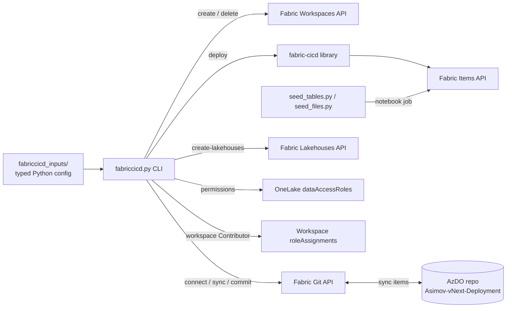
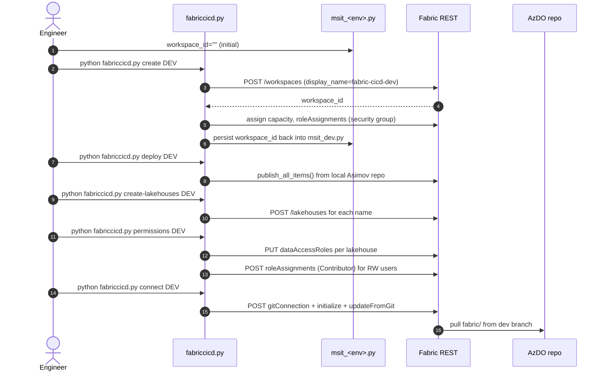

# Fabric CI/CD Deployment Toolkit

End-to-end automation for provisioning, deploying, and securing Microsoft Fabric workspaces (DEV / TEST / PROD) using a typed-Python configuration package and a single CLI driver.

This is a thin layer on top of the [`fabric-cicd`](https://github.com/microsoft/fabric-cicd) library that adds:

- A typed inputs package (`fabriccicd_inputs/`) — one Python module per environment.
- A unified CLI (`fabriccicd.py`) — workspace creation, git connect, deploy, lakehouse provisioning, and **fine-grained data access** (workspace / lakehouse / table / file).
- One-shot data seeders (`seed_tables.py`, `seed_files.py`) for demo content.

---

## Table of contents

- [Architecture](#architecture)
- [Repository layout](#repository-layout)
- [Prerequisites](#prerequisites)
- [Setup](#setup)
- [The two repos involved](#the-two-repos-involved)
- [Configuration model — `fabriccicd_inputs/`](#configuration-model--fabriccicd_inputs)
- [The CLI — `fabriccicd.py`](#the-cli--fabriccicdpy)
- [End-to-end flow (first-time deploy)](#end-to-end-flow-first-time-deploy)
- [Permissions model](#permissions-model)
- [Demo data seeders](#demo-data-seeders)
- [Day-to-day workflows](#day-to-day-workflows)
- [Test & verification reference](#test--verification-reference)
- [Troubleshooting](#troubleshooting)
- [FAQ for reviewers / leads](#faq-for-reviewers--leads)

---

## Architecture



Two surfaces of access:

| Surface                      | API               | Granularity                                    | Effective verbs                     |
| ---------------------------- | ----------------- | ---------------------------------------------- | ----------------------------------- |
| **Workspace role**           | `roleAssignments` | Whole workspace                                | Read, Write, Admin                  |
| **OneLake data access role** | `dataAccessRoles` | Path-scoped (`*`, `/Tables/<t>`, `/Files/<p>`) | Read or ReadWrite (per current API) |

---

## Repository layout

```
fabric-cicd/
├── fabriccicd.py               # The CLI driver
├── fabriccicd_inputs/          # Typed config package (single source of truth)
│   ├── __init__.py             # Assembles MSIT_TOPOLOGY + REALM_TOPOLOGY
│   ├── _schema.py              # Enums + dataclasses (no values)
│   ├── _common.py              # Shared values (project, repo, capacities, security group)
│   ├── msit_dev.py             # MSIT DEV workspace (lakehouses + access)
│   ├── msit_test.py            # MSIT TEST workspace
│   ├── msit_prod.py            # MSIT PROD workspace
│   ├── realm_dev.py            # Realm DEV workspace (alt tenant)
│   ├── realm_test.py
│   ├── realm_prod.py
│   └── README.md               # Inputs-package docs
├── seed_tables.py              # One-shot: create demo Delta tables in DEV
├── seed_files.py               # One-shot: create demo CSVs under Files/raw
├── src/fabric_cicd/            # Vendored fabric-cicd library (with a local fix)
└── tests/                      # Library tests (not the deployment toolkit)
```

---

## Prerequisites

- Python 3.9+
- Azure CLI installed and `az login` completed (the toolkit uses `AzureCliCredential`)
- Access to the target Fabric tenant (MSIT today; Realm topology supported via `--realm`)
- Git configured for the AzDO repo `msazure/One/Asimov-vNext-Deployment`
- Membership in the workspace-prefix security group (`fabric-cicd-contributors` by default)

---

## Setup

```powershell
# Clone this repo
git clone <fabric-cicd repo url>
cd fabric-cicd

# Install dev dependencies (uses uv per copilot-instructions.md)
pip install uv
uv sync --dev

# Sign in to Azure
az login

# Sanity check
python -c "from fabriccicd_inputs import get_workspace; print(get_workspace('DEV').workspace_id)"
```

---

## The two repos involved

| Repo                                             | Purpose                                                                                                                                                              |
| ------------------------------------------------ | -------------------------------------------------------------------------------------------------------------------------------------------------------------------- |
| **`fabric-cicd`** (this one)                     | The deployment toolkit (CLI + typed inputs + library)                                                                                                                |
| **`msazure/One/Asimov-vNext-Deployment`** (AzDO) | The **Fabric content repo** — actual notebooks, pipelines, lakehouses, semantic models. Lives under `fabric/` on `dev` branch. Workspaces are git-connected to this. |

The CLI's `connect` command points each Fabric workspace at the `fabric/` directory of the `dev` branch in the AzDO repo. After that, any `git push` to `dev` can be `sync`'d into the workspace, or any UI edit can be `commit`'d back to git.

---

## Configuration model — `fabriccicd_inputs/`

Everything that varies per environment lives here as **typed Python**.

### Topology

```python
MSIT_TOPOLOGY = FabricTopology(
    metadata=PROJECT,                       # tenant, team, project name
    source_control=REPO,                    # AzDO org/project/repo/branch/dir
    repo_path=REPO_PATH,                    # local clone path
    workspace_prefix=WORKSPACE_PREFIX,      # e.g. "fabric-cicd"
    workspaces={
        "DEV":  msit_dev.WORKSPACE,
        "TEST": msit_test.WORKSPACE,
        "PROD": msit_prod.WORKSPACE,
    },
)
```

### Per-env file (`msit_dev.py`)

```python
LAKEHOUSES = [
    LakehouseDefinition(
        name="Lakehouse1",
        access_list=[
            DataAccessEntry(display_name="Sikana", email="sikana@...", permission=DataPermission.ReadWrite),
        ],
        table_access=[
            TableAccessEntry(display_name="Sikana", email="sikana@...", tables=["customers"], permission=DataPermission.ReadWrite),
        ],
        file_access=[
            FileAccessEntry(display_name="Sikana", email="sikana@...", paths=["/Files/raw/customers.csv"], permission=DataPermission.ReadWrite),
        ],
    ),
    # ... Lakehouse2 ... 5
]

WORKSPACE = WorkspaceEnvironment(
    target=TargetEnvironment.DEV,
    workspace_id="...",                     # auto-persisted on first `create`
    capacity=MSIT_CAPACITY,
    access_control=[SECURITY_GROUP],
    lakehouses=LAKEHOUSES,
)
```

### Public symbols (importable from `fabriccicd_inputs`)

`MSIT_TOPOLOGY`, `REALM_TOPOLOGY`, `get_topology(realm_mode)`, `get_workspace(env, realm_mode)`, plus all schema types: `WorkspaceEnvironment`, `LakehouseDefinition`, `DataAccessEntry`, `TableAccessEntry`, `FileAccessEntry`, `DataPermission`, `Identity`, `IdentityKind`, `WorkspaceRole`, `FabricCapacity`, `SourceControlSettings`.

### Per-env access matrix

| Env  | Where access is declared    | Default state today                                                                        |
| ---- | --------------------------- | ------------------------------------------------------------------------------------------ |
| DEV  | `msit_dev.py` `LAKEHOUSES`  | Full matrix (Sikana + Vijay grants on Lakehouse1, Vijay on Lakehouse2, dummy users on 3–5) |
| TEST | `msit_test.py` `LAKEHOUSES` | Lakehouse names registered, no per-user grants yet                                         |
| PROD | `msit_prod.py` `LAKEHOUSES` | Lakehouse names registered, no per-user grants yet                                         |

---

## The CLI — `fabriccicd.py`

```
python fabriccicd.py <command> [ENV] [--realm]
```

| Command                 | What it does                                                                                                               |
| ----------------------- | -------------------------------------------------------------------------------------------------------------------------- |
| `check ENV`             | Validates auth, tenant, capacity reachability                                                                              |
| `create [ENV]`          | Creates the workspace, assigns capacity, applies `access_control`, writes the new `workspace_id` back into `msit_<env>.py` |
| `clean ENV`             | Deletes all items in the workspace (preserves the workspace)                                                               |
| `delete-workspace ENV`  | Hard-deletes the workspace                                                                                                 |
| `sync ENV`              | `updateFromGit` — pulls repo into workspace                                                                                |
| `commit ENV`            | `commitToGit` — pushes UI changes back to git                                                                              |
| `connect ENV`           | Connects workspace to the AzDO repo (`fabric/` on `dev`) and runs initial sync                                             |
| `deploy ENV`            | Runs `fabric_cicd.publish_all_items` against the workspace                                                                 |
| `create-lakehouses ENV` | Provisions every lakehouse declared in the env                                                                             |
| `permissions ENV`       | Applies `dataAccessRoles` (whole / table / file) **and** grants workspace Contributor for any RW user                      |
| `all ENV`               | check → create → clean → deploy → lakehouses → permissions → connect (DEV only by default)                                 |

Add `--realm` to any command to use the Realm tenant/topology instead of MSIT.

---

## End-to-end flow (first-time deploy)



After this, the workspace is live, items are deployed, permissions are applied, and the workspace is bidirectionally git-linked.

---

## Permissions model

Two API surfaces, applied together by `permissions`:

### 1. Workspace role (`POST /workspaces/{id}/roleAssignments`)

- Source: `WorkspaceEnvironment.access_control` (security groups) + auto-promotion of any RW user.
- Effect: Grants Read/Write/Admin across the **entire workspace**.

### 2. OneLake data access roles (`PUT /lakehouses/{id}/dataAccessRoles`)

- Source: `LakehouseDefinition.access_list` / `table_access` / `file_access`.
- Effect: Path-scoped roles. The OneLake API accepts only `Read` or `ReadWrite` as the Action.

| Source field   | Path scope           | Example role name                                 |
| -------------- | -------------------- | ------------------------------------------------- |
| `access_list`  | `Path = "*"`         | `Lakehouse1SikanaTanupabrungsun`                  |
| `table_access` | `Path = /Tables/<t>` | `Lakehouse1SikanaTanupabrungsuncustomers`         |
| `file_access`  | `Path = /Files/<p>`  | `Lakehouse1SikanaTanupabrungsunfilescustomerscsv` |

> **Important:** Workspace `Contributor` is what actually enables Write. Path-scoped roles **filter Read** — they do not stop a workspace Contributor from writing. If you need to give read-only-on-X to someone who must NOT write elsewhere, leave them as workspace Viewer (or do not add to `access_control`) and grant the data role for X.

---

## Demo data seeders

| Script                  | Creates                                                                                |
| ----------------------- | -------------------------------------------------------------------------------------- |
| `python seed_tables.py` | Delta tables: Lakehouse1 → `customers`, `orders`; Lakehouse2 → `products`, `inventory` |
| `python seed_files.py`  | CSVs under `Files/raw/`: same four datasets                                            |

Both upload a notebook, run it as a Spark job, and poll until `Completed`. Idempotent (notebook update if it already exists).

---

## Day-to-day workflows

### Add a user to a lakehouse

1. Open `fabriccicd_inputs/msit_<env>.py`.
2. Add a `DataAccessEntry(...)` to the right `LakehouseDefinition.access_list`.
3. Run `python fabriccicd.py permissions <ENV>`.

### Grant read access to a single table or file

```python
table_access=[
    TableAccessEntry(display_name="Alice", email="alice@...",
                     tables=["orders"], permission=DataPermission.Read),
],
file_access=[
    FileAccessEntry(display_name="Alice", email="alice@...",
                    paths=["/Files/raw/orders.csv"], permission=DataPermission.Read),
],
```

Then `permissions <ENV>`.

### Promote DEV access matrix to TEST/PROD

Copy the `LAKEHOUSES = [...]` block from `msit_dev.py` into `msit_test.py` / `msit_prod.py`, optionally downgrading `permission=DataPermission.Read` for stricter envs. Then `permissions <ENV>`.

### Provision a new env

1. In a new file (e.g. `msit_staging.py`), define `WORKSPACE = WorkspaceEnvironment(workspace_id="", ...)`.
2. Register it in `MSIT_TOPOLOGY.workspaces` in `__init__.py`.
3. `python fabriccicd.py create STAGING` — driver writes `workspace_id` back.
4. `python fabriccicd.py all STAGING`.

### Re-deploy after pulling new git changes

```powershell
python fabriccicd.py sync DEV       # workspace ← git
# or
python fabriccicd.py deploy DEV     # workspace ← repo via fabric-cicd
```

---

## Test & verification reference

### A. Smoke tests (no Fabric calls)

```powershell
# Imports + topology assembly
python -c "from fabriccicd_inputs import MSIT_TOPOLOGY, REALM_TOPOLOGY, get_workspace; print(list(MSIT_TOPOLOGY.workspaces))"

# CLI help
python fabriccicd.py
```

### B. Read-only verification (auth required)

```powershell
# Auth + tenant reach
python fabriccicd.py check DEV

# List items in workspace
$tok = az account get-access-token --resource https://api.fabric.microsoft.com --query accessToken -o tsv
$h = @{Authorization="Bearer $tok"}
$ws = "<workspace-id>"
Invoke-RestMethod "https://api.fabric.microsoft.com/v1/workspaces/$ws/items" -Headers $h | Select -Expand value | Format-Table displayName, type

# List lakehouses
Invoke-RestMethod "https://api.fabric.microsoft.com/v1/workspaces/$ws/lakehouses" -Headers $h | Select -Expand value | Format-Table displayName, id

# List data access roles for a lakehouse
$lh = "<lakehouse-id>"
$r = Invoke-RestMethod "https://api.fabric.microsoft.com/v1/workspaces/$ws/items/$lh/dataAccessRoles" -Headers $h
$r.value | ForEach-Object {
    "$($_.name) | actions=$($_.decisionRules[0].permission[1].attributeValueIncludedIn -join ',') | paths=$($_.decisionRules[0].permission[0].attributeValueIncludedIn -join ',')"
}

# List workspace role assignments
Invoke-RestMethod "https://api.fabric.microsoft.com/v1/workspaces/$ws/roleAssignments" -Headers $h | Select -Expand value | ForEach-Object { "$($_.principal.displayName) -> $($_.role)" }
```

### C. Mutating tests (use a throwaway workspace)

| Step                     | Command                                      | Expected                                                    |
| ------------------------ | -------------------------------------------- | ----------------------------------------------------------- |
| 1. Create                | `python fabriccicd.py create DEV`            | New workspace; `workspace_id` written back to `msit_dev.py` |
| 2. Re-create idempotency | repeat above                                 | "Already exists" log; reuses GUID                           |
| 3. Deploy                | `python fabriccicd.py deploy DEV`            | All items from `Asimov-vNext-Deployment/fabric/` appear     |
| 4. Lakehouses            | `python fabriccicd.py create-lakehouses DEV` | All five lakehouses created                                 |
| 5. Permissions           | `python fabriccicd.py permissions DEV`       | Roles match inputs (verify with section B)                  |
| 6. Git connect           | `python fabriccicd.py connect DEV`           | Workspace and git in sync                                   |
| 7. Seed tables           | `python seed_tables.py`                      | Notebook job `Completed`; tables visible in lakehouses      |
| 8. Seed files            | `python seed_files.py`                       | CSVs visible under `Files/raw/`                             |
| 9. Cleanup               | `python fabriccicd.py clean DEV`             | Items removed (workspace kept)                              |
| 10. Delete env           | `python fabriccicd.py delete-workspace DEV`  | Workspace gone                                              |

### D. Per-env isolation check

```powershell
python -c "from fabriccicd_inputs import get_workspace; [print(e, [(lh.name, len(lh.access_list), len(lh.table_access), len(lh.file_access)) for lh in get_workspace(e).lakehouses]) for e in ['DEV','TEST','PROD']]"
```

DEV should be populated; TEST/PROD should report zeros (until you fill them in).

---

## Troubleshooting

| Symptom                                                 | Likely cause                         | Fix                                                            |
| ------------------------------------------------------- | ------------------------------------ | -------------------------------------------------------------- |
| `CredentialUnavailableError`                            | Not signed into Azure CLI            | `az login`                                                     |
| Workspace name 409 on create                            | Already exists                       | The driver auto-detects and reuses; check log                  |
| `Could not resolve user X`                              | Email not in tenant Graph            | Use a real Microsoft email or service principal object_id      |
| Permissions show `Read` only in portal                  | Pre-fix code path                    | Update to latest `fabriccicd.py`; API allows `ReadWrite`       |
| `permissions` PUT 400 `InvalidObjectInPermissionsScope` | Action other than `Read`/`ReadWrite` | API only accepts those two values                              |
| Sikana can't write despite RW                           | Not workspace Contributor            | `permissions` auto-promotes RW users; check `roleAssignments`  |
| `updateFromGit` LRO returns Failed but items deployed   | Cosmetic metadata reconciliation     | Items are fine; safe to ignore                                 |
| Duplicate item errors during git sync                   | Items existed unlinked               | Always deploy first, connect last (this is the order in `all`) |

---

## FAQ for reviewers / leads

**Q: Are lakehouses defined in `msit_*.py` re-created from these definitions?**  
No. Lakehouse **artifacts** sync from the AzDO `fabric/` directory via git connection. The `LakehouseDefinition` entries in `msit_*.py` exist purely to declare **per-environment data access policy** (Fabric's git sync does NOT carry data access roles).

**Q: Is `workspace_id` auto-discovered each run?**  
No, it's a literal in `msit_<env>.py`. On first `create`, the driver writes the new GUID back. After that, every command targets that GUID. To adopt an existing workspace, paste its GUID from the portal URL.

**Q: Why is the OneLake role displayed as "Read" in the portal even when we sent ReadWrite?**  
After the latest fix it correctly shows `ReadWrite`. If you still see `Read`, you're on a pre-fix build — pull and re-run `permissions <ENV>`.

**Q: Why do RW users get workspace Contributor automatically?**  
OneLake fine-grained roles only filter **Read**. To actually let a user write, they must hold a workspace role with write permission. The driver auto-promotes them to Contributor (idempotently) so behavior matches the declared intent.

**Q: How is per-environment access kept separate?**  
Each env has its own file (`msit_dev.py` / `msit_test.py` / `msit_prod.py`) with its own `LAKEHOUSES` list. There is no shared mutable state — mutating DEV does not affect TEST/PROD.

**Q: How do we add a new Fabric item type to the deploy?**  
Use the **New Item Type** subagent for the `fabric-cicd` library; the typed inputs package doesn't need a change unless you want env-specific config for that item type.

---

## Open PRs / branches relevant to this toolkit

- **microsoft/fabric-cicd** — `fix/lakehouse-artifact-id-vj` (lakehouse GUID fix in SparkJobDefinition publisher)
- **AzDO Asimov-vNext-Deployment** — `chore/update-scripts-vj` (this toolkit committed under `scripts/`)

---

## License & ownership

Internal Microsoft tooling for the DnA Core team. Built on top of the open-source `fabric-cicd` library.
